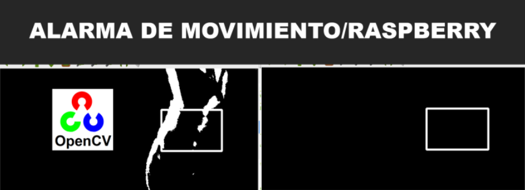

# Alarma detección de movimiento [](http://golang.org)


## Descripción
Este proyecto utiliza una cámara (webcam o raspicam) para detectar movimiento en una zona de la pantalla específica. La detección de movimiento se realiza utilizando la biblioteca OpenCV y se envía una notificación por correo electrónico con un video adjunto cuando se detecta movimiento. 

Además, se reproduce una alarma sonora utilizando la biblioteca winsound. Esto puede ser útil en aplicaciones de seguridad, monitoreo de espacios o cualquier situación donde se requiera detectar actividad en una región determinada.

El proyecto está desarrollado en Python y hace uso de las siguientes librerías:


-  Se utiliza para el procesamiento de imágenes y la detección de movimiento en tiempo real.
-  Se utiliza para el envío de correos electrónicos con el video que muestra el movimiento detectado.
-  Se utiliza para generar una alarma sonora cuando se detecta movimiento.

## Uso
Sigue estos pasos para utilizar el proyecto de detección de movimiento:

1. **Requisitos previos:** Asegúrate de tener instalado Python en tu sistema.


2. **Clonar el repositorio:** Clona este repositorio en tu máquina local.


3. **Instalar dependencias:**


Ejecuta el siguiente comando para instalar las bibliotecas requeridas:
```commandline
pip install -r requirements.txt
```


4. **Configuración de la cámara:** Si utilizas una cámara externa, asegúrate de que esté correctamente conectada y reconocida por tu sistema.


5. **Configuración del correo electrónico:** En el archivo detector_movimiento.py, actualiza los siguientes valores para configurar el servidor de correo electrónico y las credenciales de autenticación:

- smtp_server: El servidor SMTP a utilizar (por ejemplo, 'smtp.gmail.com' para Gmail).
- smtp_port: El puerto del servidor SMTP (por ejemplo, 587 para Gmail).
- email_from: La dirección de correo electrónico del remitente.
- email_to: La dirección de correo electrónico del destinatario.
- smtp_username: El nombre de usuario del servidor SMTP.
- smtp_password: La contraseña del servidor SMTP.


6. **Ejecución del programa:** Ejecuta el archivo detector_movimiento.py para iniciar la detección de movimiento. La cámara capturará el video y detectará el movimiento en tiempo real. Cuando se detecte movimiento, se mostrará un rectángulo rojo alrededor del objeto en movimiento, se reproducirá una alarma sonora y se grabará un video llamado video.avi. Finalmente, se enviará un correo electrónico con el video adjunto al destinatario especificado.


**Nota: Asegúrate de tener una conexión a Internet activa para enviar el correo electrónico con el video adjunto.**

